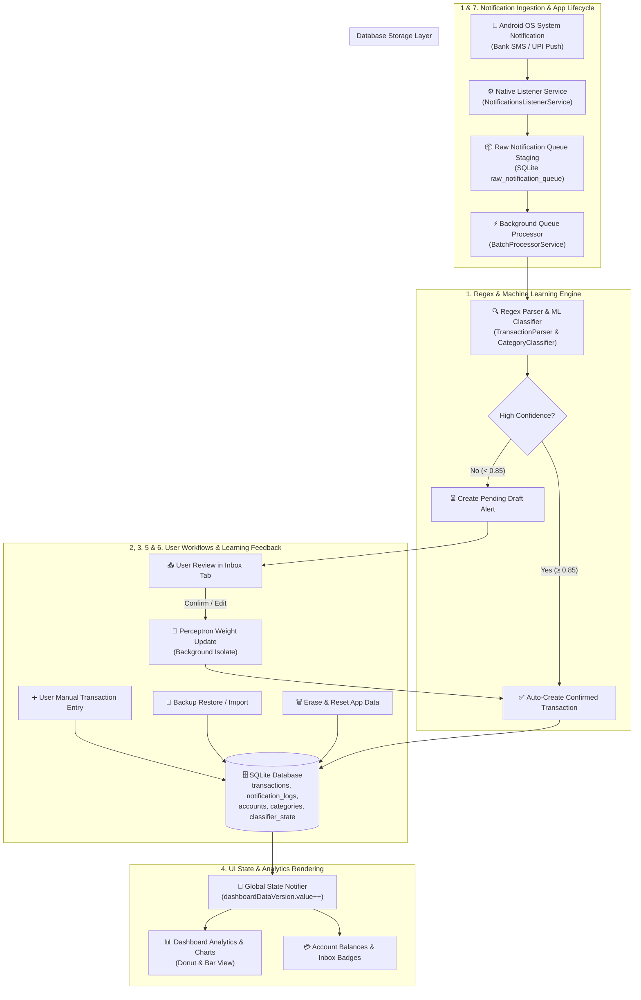

# High-Level Design (HLD) — Smart Finance Tracker

## 1. System Overview

**Smart Finance Tracker** is an offline-first, privacy-focused mobile personal finance application built with Flutter. It automatically intercepts financial transaction notifications (SMS and UPI Push notifications) on Android devices, parses merchant and monetary details, auto-classifies transactions into categories using an on-device Machine Learning engine, and presents interactive financial analytics.

### Key Architectural Principles
- **100% Offline & Private**: All data processing, SQLite storage, and Machine Learning classification occur strictly on-device with zero external API calls or cloud dependencies.
- **Zero-Battery Ingestion**: Background notification events are ingested into an atomic SQLite staging queue, minimizing awake time and CPU consumption.
- **On-Device Continuous Learning**: Perceptron ML model weights adapt locally in real time whenever the user approves, edits, or discards transaction drafts.
- **Consistent Timestamping**: All temporal events across SQLite tables are stored as 64-bit integer Unix epoch milliseconds for high-performance range queries and seamless timezone independence.

---

## 2. End-to-End System Flowchart

The following flowchart illustrates the 7 core operational flows of the application across system boundaries:

---

## 3. Core System Workflows

### 3.1. Notification Ingestion & Auto-Classification
1. When a bank SMS or UPI notification arrives, Android's `NotificationsListenerService` captures the raw package name, title, text body, and timestamp.
2. The payload is written atomically into `raw_notification_queue` with status `'pending'`.
3. `BatchProcessorService` picks up pending items, passing them to `TransactionParser`.
4. `TransactionParser` extracts amount, transaction type (debit/credit), merchant description, and account references using pre-compiled regular expressions.
5. `CategoryClassifier` runs a 2-gram BIO Perceptron model to predict category and account. If confidence is $\ge 85\%$, the transaction is auto-confirmed; otherwise, it is staged as a pending verification alert.

### 3.2. Draft Review & Machine Learning Feedback Loop
1. Pending draft alerts appear in the **Inbox** tab.
2. When the user confirms or modifies a draft's category/account, `PerceptronStorageService` updates feature weight vectors.
3. The weight update is computed in a background worker isolate (`compute()`) and persisted to local storage.
4. The draft transitions to a confirmed transaction, and the navbar pending count updates.

### 3.3. Manual Transaction Entry
1. Users can manually record cash or un-tracked transactions via the transaction form sheet.
2. Input fields validate amount, type, account, category, and date.
3. Upon saving, `DatabaseService` writes the row into `transactions` and recalculates account balances.

### 4.4. Dashboard Analytics & Dynamic Date Filtering
1. Users filter financial data using timeframe choice chips (*This Month*, *This Week*, *This Year*, *All Time*, *Custom*).
2. `FilterLogic` translates canonical timeframe keys into epoch millisecond boundaries.
3. Confirmed transactions within the boundary are aggregated to compute spending totals, category percentages for the Donut Chart, and daily/monthly trends for the Bar Chart.

### 3.5. Backup, Restore & Data Import
1. Users can export full database state into a JSON backup file or CSV report.
2. Import supports **Override Mode** (wipe and replace) and **Append Mode** (deduplicated merge).
3. The importer validates payload structure and converts incoming timestamps into epoch milliseconds.

### 3.6. Database Reset & Factory Re-Seed
1. Users can trigger **Erase All App Data** from Developer Options.
2. After warning dialog confirmation, a database transaction wipes all rows across all tables.
3. `_seedDefaultData` re-populates initial accounts (*Cash*, *Bank Account*, *Credit Card*) and categories (*Food*, *Shopping*, *Travel*, etc.).

### 3.7. App Lifecycle & Queue Recovery
1. When the app resumes from background or after device boot, `WidgetsBindingObserver` triggers `_processQueuedNotifications()`.
2. Any unprocessed notifications captured while the app was closed are parsed and added to the Inbox.

---

## 4. Security & Privacy Model

- **Zero Network Transmission**: The application requests no internet permissions (`android.permission.INTERNET` is omitted).
- **Sandboxed Local Storage**: SQLite database files and Machine Learning weights are stored inside Android app-private storage (`/data/user/0/<package>/databases/`).
- **User-Controlled Data Wiping**: Users can purge model audit logs, clear notifications, or execute a complete database reset at any time.

