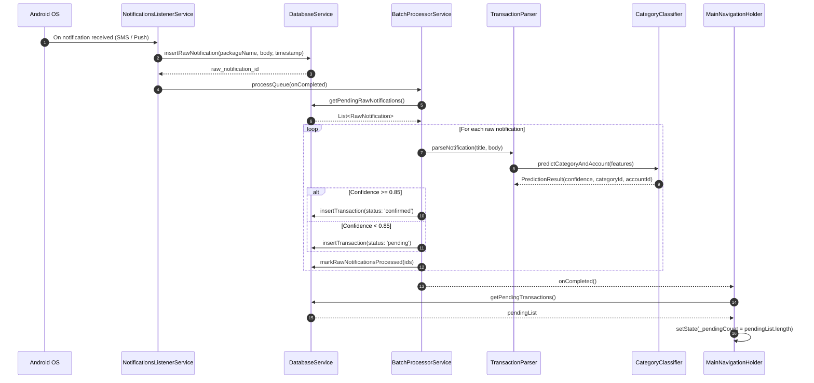
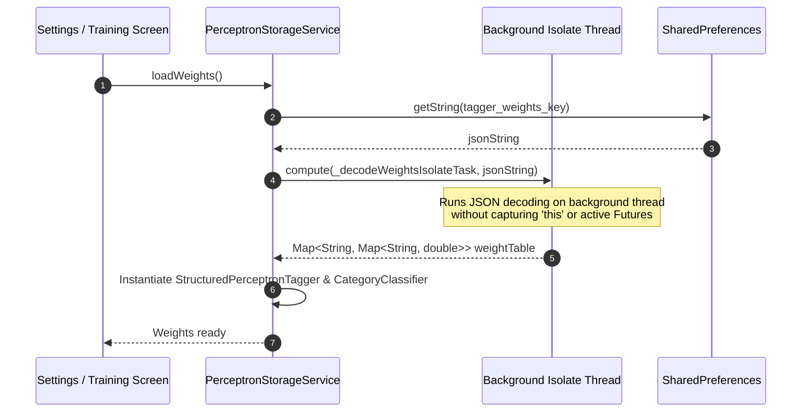

# Low-Level Design (LLD) — Smart Finance Tracker

## 1. Codebase Architecture

The project follows a feature-driven modular structure separating data models, services, UI screens, shared widgets, and localization:

```text
lib/
├── features/
│   ├── dashboard/               # Dashboard screen, analytics cards, donut & bar charts
│   │   ├── logic/               # FilterLogic & PrivacyLogic
│   │   ├── state/               # DashboardStateMixin & reactive controllers
│   │   └── widgets/             # AnalyticsCard, AccountCards, DonutChart, BarChart
│   └── inbox/                   # Inbox verification tab & audit log widgets
├── l10n/                        # Flutter l10n ARB files (app_en.arb, app_te.arb)
├── models/                      # TransactionModel, AccountModel, CategoryModel
├── screens/                     # MainNavigationHolder, SettingsScreen, LogInspectorScreen
├── services/                    # DatabaseService, BackupService, NotificationHandler, BatchProcessor, PerceptronStorage
├── shared/                      # Shared bottom sheets & dialogs
└── utils/                       # TransactionParser, BioTagger, CategoryClassifier, AppSettings, AppSnackBar
```

---

## 2. Core Data Models & Schemas

### 2.1. TransactionModel
Represents a financial debit, credit, or transfer event.

```dart
class TransactionModel {
  final int? id;
  final String? appName;
  final String title;
  final String body;
  final double amount;
  final String type; // 'debit', 'credit', 'transfer'
  final int accountId;
  final int? toAccountId;
  final int categoryId;
  final String description;
  final DateTime date; // Mapped to 64-bit INTEGER timestamp in SQLite
  final String status; // 'confirmed', 'pending', 'archived'
  final int? notificationLogId;
}
```

#### Mapping Logic
- `toMap()`: Serializes `date` as `'timestamp': date.millisecondsSinceEpoch`.
- `fromMap()`: Deserializes `'timestamp'` using `DateTime.fromMillisecondsSinceEpoch((map['timestamp'] as num).toInt())`.

---

## 3. Sequence Diagrams

### 3.1. Notification Processing Sequence



---

### 3.2. Background Isolate ML Weight Operations



---

## 4. Subsystem Interfaces

### 4.1. DatabaseService Singleton (`database_service.dart`)
Centralized SQLite data access manager.

```dart
class DatabaseService {
  static final DatabaseService instance = DatabaseService._privateConstructor();
  final ValueNotifier<int> dashboardDataVersion = ValueNotifier<int>(0);

  Future<Database> get database;
  Future<List<TransactionModel>> getConfirmedTransactions();
  Future<List<TransactionModel>> getPendingTransactions();
  Future<int> insertTransaction(TransactionModel transaction);
  Future<int> updateTransaction(TransactionModel transaction);
  Future<int> deleteTransaction(int id);
  Future<void> eraseAllData();
  void notifyDashboardDataChanged();
}
```

### 4.2. BackupService (`backup_service.dart`)
Handles JSON and CSV data import, export, and transactional migration.

```dart
class BackupService {
  static Future<String> generateJSONString();
  static Future<String> generateCSVString();
  static Future<bool> importBackupJSON(String jsonContent, {required ImportMode mode});
  static Future<bool> restoreBackupJSON(String jsonContent);
}
```

---

## 5. Reactive State Management & UI Binding

### 5.1. Global Reactivity Loop
The application uses light, zero-boilerplate Flutter reactive primitives (`ValueNotifier` and `setState`):

1. **Database Version Notifier**: `DatabaseService.instance.dashboardDataVersion` (`ValueNotifier<int>`).
2. **Main Navigation Holder Listener**: Registered in `MainNavigationHolderState.initState()`:
   ```dart
   DatabaseService.instance.dashboardDataVersion.addListener(_updatePendingCount);
   ```
3. **Tab Page Preservation**: Tabs use `PageStorageKey('dashboard-tab')`, `PageStorageKey('inbox-tab')`, and `PageStorageKey('settings-tab')` inside a `PageView` with `NeverScrollableScrollPhysics` to preserve scroll positions and state across tab switches.

