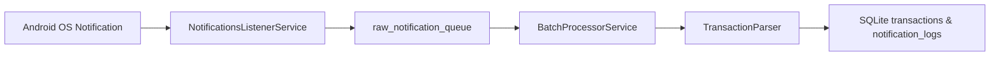

# Android Notification Pipeline Architecture

## 1. Overview
The Android Notification Pipeline provides background and foreground interception of bank SMS messages and UPI Push notifications without incurring high battery drain.

---

## 2. Component Structure

### 2.1. Android Native Service (`NotificationsListenerService`)
Extends Android's `NotificationListenerService`.
- Intercepts incoming `StatusBarNotification` events.
- Extracts package name, title, body, and timestamp.
- Filters out non-financial packages (e.g. system UI, messaging apps not on the user's allowlist).

### 2.2. Zero-Battery Staging Queue (`raw_notification_queue`)
- To prevent heavy CPU processing on the main Android thread when a notification arrives, the native listener writes the payload directly into SQLite table `raw_notification_queue`.
- The `idx_raw_notif_dedup` unique index prevents duplicate notifications from being queued twice within short time windows.

### 2.3. Foreground / Background Bridge (`NotificationHandler`)
- Uses Flutter's `IsolateNameServer` to establish an inter-process communication port (`NotificationHandler.portName`).
- When the Flutter engine is active, `NotificationHandler` receives notification callbacks and triggers `BatchProcessorService.instance.processQueue()`.

---

## 3. Parsing & Staging Workflow

